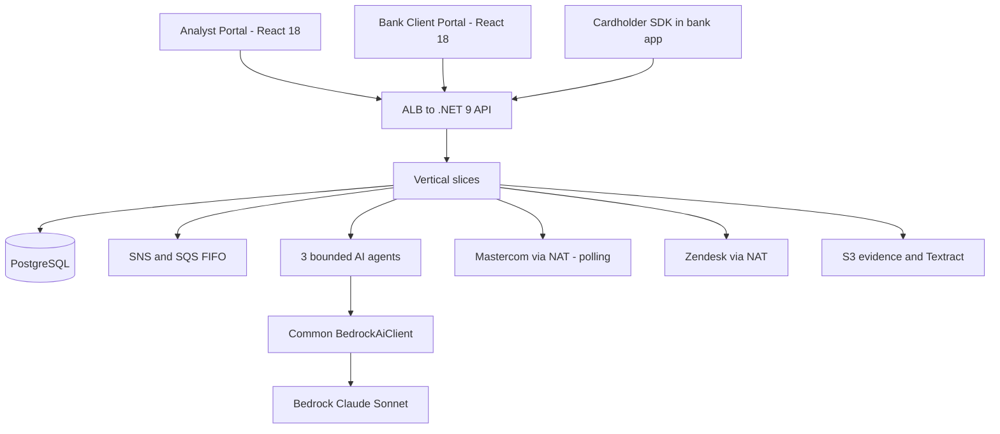
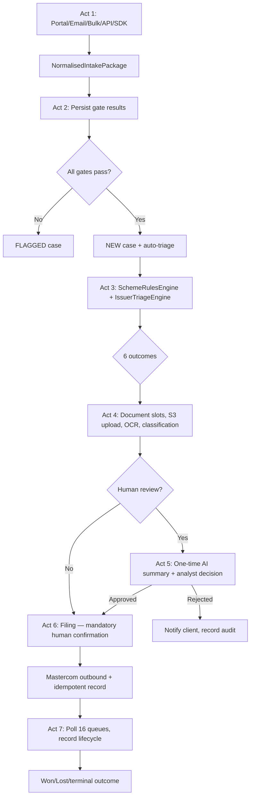

# Chargeback Management Platform — Unified Frontend, Backend & AI Development Guide

**Version:** 1.10 — merges the team's v1.9 additions with the facts checked against the code:
- **New sections:** §5.1 RLS design, the shared message thread note, the review decision body, and §8 #41–43 in the team's numbering. The portal status vocabulary moves to #44.
- **Kept as shipped:** the decision contract: `Approve`/`Reject`, rationale 1–4,000 characters, `409 CASE_VERSION_MISMATCH`, and no reason-code lookup endpoint.
- **Confirmed:** `FILE` needs `SUBMIT_MASTERCOM`.
- **Corrected:** migration names (`0008_admin_user_management.sql`, `0010_row_level_security.sql`), the protected-table list (no `case_events`, `users` or `gate_definitions`), the document statuses, and the dev CORS origins.

Previous: v1.9 — RLS shipped (migration 0010).  
**Source:** Six user-supplied diagrams plus session decisions (Sep–Oct 2026).
**Scope:** A shared handoff for UI, API, AI and database engineers.
**Important:** Diagram-aligned MVP baseline. Do not mix with the expanded 110-feature package.

## 1. What the teams are building

A licensed Chargeback Management Platform deployed once in a processor-owned AWS account/VPC, serving several bank clients. Three frontend surfaces: processor Analyst Portal, bank Client Portal, and an SDK embedded in a bank app. A single .NET 9 backend implements business workflows. Three bounded logical AI agents provide extraction, classification and explanation, but cannot select final reason codes, file claims, change case state or move money. PostgreSQL holds transactional data and versioned authoritative rules; private S3 holds evidence files. Mastercom and Zendesk are outbound integrations.



## 2. Frontend architecture — React 18

| Surface | Main pages / functions | Access boundary |
|---|---|---|
| Analyst Portal | Intake queue, case list/detail/timeline, human review, evidence/document checklist, filing, client communications, Admin/Settings | Processor users with explicit permissions and permitted bank scope |
| Bank Client Portal | Intake form, CSV/Excel dry-run and upload, own cases, evidence upload, message thread, notifications | Bank user; only own bank data |
| Embedded SDK | Conversational guided intake, eligibility pre-check, structured intake submission | Runs in bank app, uses host-app/session integration, not Client Portal session |

**Frontend flow:** React Router → page → feature hooks → API service → HTTPS .NET API. React Query/TanStack Query handles server state; `authStore` holds authenticated `userType`, role, permission codes and bank scope; Zod validates API responses; React Hook Form manages forms; date-fns formats dates. Do not calculate Mastercard deadlines on the client as an authority: display server-calculated values.

**Frontend dependency constraints (do not upgrade without approval):**
- MSW v2 (not v3); ESLint v9 (not v10)
- Do NOT call Bedrock/AWS SDK from the browser
- No cross-surface imports between Analyst Portal, Client Portal, and SDK
- No portal session code in SDK

## 3. Backend architecture — .NET 9 vertical slices

**Runtime:** One ECS Fargate application. A *slice* is a code organization boundary, not a separate container or microservice.

**Approved MediatR pipeline order:** `Logging → Validation → Authorization → RlsSetup → Idempotency → Transaction → Handler`. `RlsSetup` (ADR-0006) establishes the database scope that row-level security enforces; see §5.

**Eight diagram feature slices:**
1. **Intake:** Portal/email/bulk/direct API/SDK normalization into `NormalisedIntakePackage`; 10 diagram gates; persist dispute and gate outcomes.
2. **Triage & Rules:** Deterministic rules engine; six outcomes. **Engine built; blocked on ADR-0119–0122 for real bank configuration.**
3. **Case Management:** Case creation/status, append-only event history, per-case API log. ✓ Shipped.
4. **Human Review:** Analyst decision workspace, stored AI summary (once on UNDER_REVIEW entry; never regenerated), derived reason-code confirmation, triage/activity trail. ✓ Shipped — migration 0006.
5. **Evidence & Documents:** Document slots, presigned S3 upload (no API streaming), immutable upload-stage recording, independent processing status, async OCR/classification. ✓ Shipped — migration 0007.
6. **Network Filing — Mastercom:** Explicit human confirmation; poll 16 queues. **501 stubs marked `KNOWN_LIMITATION_MASTERCOM_`.**
7. **Client Portal & Communications:** Curated bank case view, portal messages (bank↔analyst), Zendesk stub. ✓ Shipped — migration 0009.
8. **Admin & Configuration:** Banks, users, roles, permissions. ✓ Shipped — migration 0008.

**Backend dependency constraints (do not upgrade without approval):**
- MediatR pinned to v12.x (Apache-2.0) — v13+ is commercially licensed
- No AutoMapper (commercial license)
- FluentAssertions v7.x only — v8+ is commercially licensed; use v7.x or Shouldly

**Critical bank scope rule:** `NULL bank_id` on the `users` row **never implies cross-bank access**. Every processor user sees only the banks listed in their `user_bank_scopes` rows; a bank user only its own `users.bank_id`. A request to access another bank's resource returns `404`. A filter referencing an unauthorized bank returns `403`. Since migration 0010 the database enforces the same scope (row-level security).

## 3.1 Approved Permission Codes and Role Matrix (v1.9)

BANK users hold none of these permissions; they access the Client Portal through `userType = BANK` scope alone.

| Permission Code | Analyst | Senior Analyst | Compliance Officer | Admin | Migration |
|---|:---:|:---:|:---:|:---:|---|
| `VIEW_CASES` | ✓ | ✓ | ✓ | ✓ | 0005 |
| `UPDATE_CASE_STATUS` | ✓ | ✓ | ✓ | ✓ | 0005 |
| `ASSIGN_CASE` | — | ✓ | — | ✓ | 0005 |
| `VIEW_TRIAGE` | ✓ | ✓ | ✓ | ✓ | 0005 |
| `RETRIAGE_CASE` | — | ✓ | — | ✓ | 0005 |
| `VIEW_BANK_USERS` | ✓ | ✓ | ✓ | ✓ | 0005 |
| `REVIEW_CASE` | ✓ | ✓ | ✓ | ✓ | 0006 |
| `UPLOAD_DOCUMENT` | ✓ | ✓ | ✓ | ✓ | 0007 |
| `VIEW_DOCUMENTS` | ✓ | ✓ | ✓ | ✓ | 0007 |
| `MANAGE_BANK_USERS` | — | — | — | ✓ | 0008 |

The Migration column shows which migration grants the permission to roles. Permission *definitions* live in the baseline; 0002, 0003 and 0005 also add them to databases created from an earlier baseline.

**Roles (five as of migration 0008):**
- `Analyst`, `Senior Analyst`, `Compliance Officer` — PROCESSOR type
- `Admin` — ADMIN type
- `Bank User` — BANK type, **no permissions** (accesses Client Portal by userType scope alone)

**Implementation notes:**
- **`MANAGE_BANK_USERS` is Admin-only.** Migration 0008 was corrected in commit `973f1b0`. The earlier PR commits granted it to all four roles, but no environment had applied it.
- **`/admin/banks` defaults to `bankName asc`** when neither `sortBy` nor `sortDirection` is sent (commit `973f1b0`).
- **`CREATE_DISPUTE`** (ADR-0111) is defined but **not in the approved matrix**. Intake is unusable outside tests until it is assigned (§8 #21). Do not assign it without explicit product and security approval.
- **`SUBMIT_MASTERCOM`** is seeded but held by no role, so `FILE` never appears in `validActions` until the filing phase assigns it (§8 #43, confirmed).
- **Still proposed and not seeded:** `VIEW_FILINGS`, `SEND_PORTAL_MESSAGE`, `MANAGE_BANKS`, `MANAGE_ROLES`, `MANAGE_BANK_SCOPES`, `VIEW_SCHEME_RULES`, `MANAGE_SCHEME_RULES`, `MANAGE_BANK_TRIAGE_CONFIG`.
- **Unused legacy codes,** seeded but held by no role: `VIEW_BANKS`, `CREATE_BANK_USER`, `UPDATE_BANK_USER`, `DISABLE_BANK_USER` (§8 #36).
- **Frontend:** permission codes are declared in `packages/domain/src/auth.ts`.

## 3.2 Case Status Vocabulary and Transition Model (v1.9)

**Approved status values:** `NEW` | `FLAGGED` | `UNDER_REVIEW` | `APPROVED` | `REJECTED` | `FILED` | `CLOSED`

**Transition endpoint:**
```
POST /cases/{caseId}/transitions
Idempotency-Key: <uuid>
{ "action": "string", "rationale": "string", "expectedVersion": number }
```
- **No PATCH** on case status. An invalid transition returns `422 INVALID_TRANSITION`; a stale `expectedVersion` returns `409 CASE_VERSION_MISMATCH`.
- **Rationale** is required for `CLOSE` and optional otherwise.
- **`APPROVE`/`REJECT`** go through `POST /cases/{id}/review/decision`. **`FILE`** is the filing flow (`POST /cases/{caseId}/filings`, then `POST /filings/{filingId}/confirmation`; both are stubs).

**Approved transition table** (implemented):

| From | Action | To | Permission / notes |
|---|---|---|---|
| `NEW` | `FLAG` | `FLAGGED` | `UPDATE_CASE_STATUS` — case status only; no re-triage |
| `NEW` | `START_REVIEW` | `UNDER_REVIEW` | `UPDATE_CASE_STATUS` |
| `FLAGGED` | `UNFLAG` | `NEW` | `UPDATE_CASE_STATUS` — case status only; no re-triage |
| `FLAGGED` | `START_REVIEW` | `UNDER_REVIEW` | `UPDATE_CASE_STATUS` |
| `UNDER_REVIEW` | → `APPROVED` | via `/review/decision` | `REVIEW_CASE` |
| `UNDER_REVIEW` | → `REJECTED` | via `/review/decision` | `REVIEW_CASE` |
| `APPROVED` | → `FILED` | via filing flow | `SUBMIT_MASTERCOM` (stub) |
| `REJECTED` | `CLOSE` | `CLOSED` | `UPDATE_CASE_STATUS` |
| `FILED` | `CLOSE` | `CLOSED` | `UPDATE_CASE_STATUS` — **Admin only** |

**`validActions`** are computed per caller from the case status, user type and permissions:

| Status | `validActions` |
|---|---|
| NEW | `["FLAG","START_REVIEW"]` |
| FLAGGED | `["UNFLAG","START_REVIEW"]` |
| UNDER_REVIEW | `["APPROVE","REJECT"]` (with `REVIEW_CASE`) |
| APPROVED | `["FILE"]` (with `SUBMIT_MASTERCOM`) |
| REJECTED | `["CLOSE"]` |
| FILED | `[]` (Admin: `["CLOSE"]`) |
| CLOSED | `[]` |

Bank users get none.

**`FILE` action (§8 #43):** `FILE` appears in `validActions` for an APPROVED case **only for a caller holding `SUBMIT_MASTERCOM`**, which no role holds today. So `FILE` never appears until the filing phase assigns it. This avoids a button whose call would fail (403/501). It is confirmed behaviour, not a gap.

**Case creation rule:** Every dispute gets a case. Gate failures → FLAGGED; all gates pass → NEW + auto-triage.

## 3.3 ADR-0106 — Idempotency Key Store (v1.5)

**Key columns:**
- `principal_id`, `operation`, `idempotency_key`;
- `request_hash` (SHA-256);
- `state` (IN_PROGRESS/COMPLETED);
- `response_status`, `response_body`, `resource_id uuid`;
- `created_at`, `completed_at timestamptz` (required when COMPLETED), `expires_at` (90-day TTL).

UNIQUE on `(principal_id, operation, idempotency_key)`.

**Pipeline position:** after `RlsSetupBehavior`, before `TransactionBehavior`.

| Condition | HTTP | Code |
|---|---|---|
| Same key, different body | 422 | `IDEMPOTENCY_KEY_REUSED` |
| Same key, in-flight | 409 | `IDEMPOTENCY_REQUEST_IN_PROGRESS` + `Retry-After: 5` |
| DLQ > 90 days | 422 | `DLQ_MESSAGE_EXPIRED` |

Replay returns stored response with `Idempotent-Replayed: true`. Failed attempts not stored. Document uploads exempt (presigned URLs expire — see §3.4).

**CORS:** Expose `Retry-After`, `Idempotent-Replayed`, `ETag`. Allow `If-Match`, `Idempotency-Key`.

## 3.4 Approved API Contracts (v1.9)

**General:** camelCase JSON; UTC ISO-8601 timestamps; RFC 7807 ProblemDetails with `traceId` (W3C format: `Activity.Current?.Id ?? HttpContext.TraceIdentifier`); case reference `CB-YYYY-NNNNNN`. The full contract is `docs/contracts/openapi-v1.json`; conventions are in `docs/contracts/api-conventions.md`.

**Pagination:**
- 1-based; default `pageSize` 20, maximum 100.
- Parameters: `page`, `pageSize`, `sortBy`, `sortDirection`.
- An out-of-range value returns `400 VALIDATION_FAILED`; an unsupported `sortBy` returns `400 INVALID_SORT_FIELD`.
- Default sort `createdAt desc`. Exception: `/admin/banks` defaults to `bankName asc`. An explicit `sortBy` without a direction is `desc`.

**Resource visibility:** other-bank resource → `404`; unauthorized bank filter → `403`.

**Evidence & Documents endpoints:**

| Endpoint | Permission | Notes |
|---|---|---|
| `POST /cases/{caseId}/documents` | `UPLOAD_DOCUMENT` | Returns `documentId` + 15-min presigned PUT URL; no Idempotency-Key |
| `POST /cases/{caseId}/documents/{documentId}/uploaded` | `UPLOAD_DOCUMENT` | Marks uploaded, queues classification; safe to repeat |
| `GET /cases/{caseId}/documents` | `VIEW_DOCUMENTS` | Slots + non-deleted documents; processing status included |
| `GET /cases/{caseId}/documents/{documentId}` | `VIEW_DOCUMENTS` | Document + latest classification |
| `DELETE /cases/{caseId}/documents/{documentId}` | `UPLOAD_DOCUMENT` | Soft-delete; 409 DOCUMENT_NOT_DELETABLE once processing starts |

**Human Review endpoints:**

| Endpoint | Permission | Notes |
|---|---|---|
| `GET /reviews/queue` | `REVIEW_CASE` | UNDER_REVIEW cases in bank scope; paginated |
| `GET /cases/{caseId}/review` | `REVIEW_CASE` | Workspace: case + dispute + gates + triage + documents + AI summary + timeline |
| `POST /cases/{caseId}/review/decision` | `REVIEW_CASE` | Body and errors below; `Idempotency-Key` required |

**`POST /cases/{caseId}/review/decision` body** (as shipped; see `openapi-v1.json`):
```json
{
  "decision": "Approve | Reject",
  "rationale": "string (required, 1–4000 chars, no card numbers)",
  "reasonCodeId": "uuid | null  (required for Approve = the case's derivedReasonCode.id; omit/null for Reject)",
  "expectedVersion": 123
}
```

**Success:** 200 with the recorded decision and the updated case (new `status`, `version`, `validActions`).

**Errors:**
- `409 CASE_VERSION_MISMATCH` (the same code as `/transitions`) when `expectedVersion` is stale. The frontend must reload the case and reset the form; it must not auto-resubmit.
- `422 INVALID_TRANSITION` when the case is not UNDER_REVIEW.
- `422 REASON_CODE_NOT_DERIVED` or `REASON_CODE_MISMATCH` on Approve.

**Reason code:** there is no reason-code lookup endpoint. The only acceptable code is the deterministic `derivedReasonCode` already returned on the case and in the review workspace. Neither analysts nor AI choose among codes.

The details below repeat the same rules.
- `rationale` is required (1–4,000 characters).
- **Approve** sends back the case's derived reason code as `reasonCodeId`; otherwise 422 `REASON_CODE_NOT_DERIVED` or `REASON_CODE_MISMATCH`.
- **Reject** omits `reasonCodeId`.

**Admin endpoints:**

| Endpoint | Permission | Notes |
|---|---|---|
| `GET /admin/banks` | `VIEW_BANK_USERS` | Paginated; filter by status; **default sort `bankName asc`** |
| `GET /admin/banks/{bankId}` | `VIEW_BANK_USERS` | Bank + active user count + users by role + caller permissions |
| `GET /admin/banks/{bankId}/users` | `VIEW_BANK_USERS` | Paginated; removed users hidden; bank-scope enforced |
| `POST /admin/banks/{bankId}/users` | `MANAGE_BANK_USERS` (Admin) | Invite; BANK-type roles only; duplicate email → 409; email stubbed `KNOWN_LIMITATION_INVITE_EMAIL_` |
| `PATCH /admin/banks/{bankId}/users/{userId}` | `MANAGE_BANK_USERS` (Admin) | Update name, role, isActive; role change audited; activating an invited user → 409 INVITE_PENDING |
| `DELETE /admin/banks/{bankId}/users/{userId}` | `MANAGE_BANK_USERS` (Admin) | Soft-delete; 409 CANNOT_DELETE_SELF |
| `GET /admin/roles` | any authenticated | Seeded roles + permissions; read-only |

**Client Portal endpoints:**

| Endpoint | Auth | Notes |
|---|---|---|
| `GET /portal/cases` | `userType = BANK` + own bank | Reduced projection; default sort `createdAt desc`; status filter |
| `GET /portal/cases/{caseId}` | `userType = BANK` + own bank | Adds reasonCode, reasonDescription, networkDeadline, documents (name + processingStatus only); no AI fields |
| `POST /portal/cases/{caseId}/messages` | `userType = BANK` + own bank | Bank user submits message; 1–2000 chars |
| `GET /portal/cases/{caseId}/messages` | `userType = BANK` + own bank | Full thread, oldest first (not paginated); no analyst identities |
| `POST /portal/cases/{caseId}/support-ticket` | `userType = BANK` + own bank | Zendesk stub; returns 202 `{ticketId: "STUB-<uuid>"}`; `KNOWN_LIMITATION_ZENDESK_` |

**Analyst message endpoints (internal):**

| Endpoint | Permission | Notes |
|---|---|---|
| `POST /cases/{caseId}/messages` | `VIEW_CASES` | Analyst reply in `portal_messages`; stored `PROCESSOR`, shown as `senderType: ANALYST` |
| `GET /cases/{caseId}/messages` | `VIEW_CASES` | Full thread view for analyst, with sender ids |

**Portal message thread:** bank users and analysts share one thread per case in `portal_messages`. The API `senderType` is `BANK_USER` or `ANALYST` (stored as `BANK` / `PROCESSOR`); the frontend should distinguish them visually. There is no analyst-only notes resource (§8 #42), so don't build one until it's decided.

**Deactivation timing note:** deactivation takes effect on the next API request (session reloads user); Cognito sessions/refresh tokens are not revoked (§8 #35).

**Gate results:** `GET /disputes/{disputeId}/gate-results` — keyed by `disputeId`.

**Filing stubs:** `POST /cases/{caseId}/filings`; `POST /filings/{filingId}/confirmation` — explicit human action required; both 501 stubs (`KNOWN_LIMITATION_MASTERCOM_`).

**PAN / sensitive data (absolute rules):** PAN masked to last 4 everywhere. AI never derives reason codes, never files, never changes case state. Explicit human confirmation required before any Mastercom filing.

## 4. AI architecture — 3 logical agents / 6 capabilities

All capabilities return "unavailable" (placeholders). AI summary written once on UNDER_REVIEW entry; never regenerated; stays empty if AI unavailable (no retry). Analysts must reload case after summary writes (version increment).

| Agent | Capability | Output |
|---|---|---|
| Extraction | Email Parser | Candidate structured facts |
| Extraction | SDK Intake Guide | Conversational draft; backend eligibility deterministic |
| Classification | Attachment Matcher | Suggested slot mapping with confidence |
| Classification | Document Verification | Suggested type/correctness; human may override |
| Analysis & Explanation | Triage Summary | Plain-English explanation of deterministic result |
| Analysis & Explanation | Evidence Analysis | Advisory strength/gaps; no filing authority |

## 5. Diagram-based PostgreSQL database

**Approved migrations (v1.9):**

| Migration | Contents | Status |
|---|---|---|
| `0001` (baseline) | Full diagram schema; `user_bank_scopes`; permission definitions; no role assignments | ✓ |
| `0002_add_create_dispute_permission.sql` | `CREATE_DISPUTE` — defined, not assigned | ✓ |
| `0003_case_management.sql` | `processed_domain_events`; `ASSIGN_CASE`; case status CHECK; `case_reference_seq` | ✓ |
| `0004_idempotency_keys.sql` | `idempotency_keys` (with `resource_id`, `completed_at`); purge indexes | ✓ |
| `0005_role_permission_matrix.sql` | `VIEW_TRIAGE`, `RETRIAGE_CASE`; 4 roles; §3.1 matrix (20 rows) | ✓ |
| `0006_human_review.sql` | `case_review_decisions` (append-only); `REVIEW_CASE`; all 4 roles | ✓ |
| `0007_evidence_documents.sql` | `documents` upload status / soft delete + immutability trigger; `document_classifications`; `UPLOAD_DOCUMENT` + `VIEW_DOCUMENTS` (8 role grants) | ✓ |
| `0008_admin_user_management.sql` | `MANAGE_BANK_USERS` (Admin only); `Bank User` role (BANK type, no permissions); `users.invited_at`, `deleted_at`, `deleted_by` | ✓ |
| `0009_portal_messages.sql` | Baseline `portal_messages`: 1–2000 char CHECK, case index, append-only trigger | ✓ |
| `0010_row_level_security.sql` | RLS enabled + forced on 12 bank-owned tables; one policy each over `app.scope` / `app.bank_ids`; `chargeback_app` and `chargeback_migrations` roles | ✓ |

**Complete install** = 0001 then every `db/migrations/NNNN_*.sql` in order. All scripts are idempotent and transactional. **None applied to a shared environment yet.**

**Row-level security (0010, ADR-0006):**
- **Session settings.** The API sets `app.scope` (`banks` / `system` / empty) and `app.bank_ids` (all the caller's banks) on every connection it opens. Unset settings mean no rows.
- **Protected tables:** `disputes`, `cases`, `gate_results`, `triage_results`, `document_slots`, `documents`, `document_classifications`, `case_review_decisions`, `portal_messages`, `zendesk_tickets`, `mastercom_filings`, `filing_api_log`.
- **Not protected:**
  - users, roles and configuration (the sign-in lookup runs before any bank is known);
  - `domain_events` and `ai_decision_logs`, which are deferred (§8 #42; see §5.1).
- **API login.** The API must connect as a non-superuser login in `chargeback_app`. Logins and passwords are created at deploy time (`KNOWN_LIMITATION_RLS_PRODUCTION_GRANTS_`).

**Document upload immutability:**
- **Frozen by trigger after creation:** `uploaded_at`, `file_name`, `mime_type`, `file_size_bytes`, `s3_key`, `scheme_stage`, `uploaded_by` and `case_id`. Rows are never deleted (soft delete).
- **Two independent statuses:**
  - `uploadStatus`: `PENDING_UPLOAD → UPLOADED`;
  - `processingStatus`: `Pending → Processing → Success | Failed`, with a failure reason such as `AI_UNAVAILABLE`.
- **Classifications** are in `document_classifications`: one row per run, never updated.

**10 gates (approved registry order):** 1 Required Fields; 2 Transaction Lookup; 3 Card/Account Check; 4 Amount/Currency Check; 5 Time Window Check; 6 Duplicate Check; 7 Merchant/Category Check; 8 Reason Code Derivation; 9 Document Requirement; 10 Compliance Check.

## 5.1 Row-Level Security design (ADR-0006, migration 0010)

**Session scope.** The API writes two settings on **every database connection it opens**, and again when the scope changes:
- `app.scope`: `banks` / `system` / empty;
- `app.bank_ids`: a `uuid[]` of all the caller's banks.

The scope is set per connection, not per transaction, because reads open no transaction. `RlsSetupBehavior` decides the scope:
- the caller's banks, for bank-, resource- and filter-scoped requests;
- `system`, for workflow steps and authorization's resource lookup;
- nothing, for `[NotBankScoped]` requests.

Unset settings mean no rows.

**Database roles:**
- `chargeback_app`: the API's runtime role; RLS is enforced (NOBYPASSRLS).
- `chargeback_migrations`: the migration runner; BYPASSRLS.

Both are NOLOGIN group roles. The logins, and their passwords from Secrets Manager, are created at deploy time (`KNOWN_LIMITATION_RLS_PRODUCTION_GRANTS_`).

**Protected tables (12)**, each with `FORCE ROW LEVEL SECURITY` and one `bank_scope` policy:
- `disputes`: directly through `bank_id`;
- `cases` and `gate_results`: through their dispute;
- `triage_results`, `document_slots`, `documents`, `case_review_decisions`, `portal_messages`, `zendesk_tickets` and `mastercom_filings`: through their case;
- `document_classifications`: through its document;
- `filing_api_log`: through its filing.

**Not protected:**
- `roles`, `permissions`, `role_permissions`, `users` (the sign-in lookup runs before any bank is known), `user_bank_scopes`, `banks`, `scheme_reason_codes`, `scheme_rule_specs`, `idempotency_keys`, `processed_domain_events`;
- `domain_events` and `ai_decision_logs`: written outside the request scope (§8 #42).

There are no `case_events` or `gate_definitions` tables.

**Policy pattern** (helper functions, `SECURITY INVOKER`):
- Direct: `rls_is_system() OR bank_id = ANY(rls_bank_ids())`.
- Indirect: `rls_dispute_visible(dispute_id)` or `rls_case_visible(case_id)`. These are `EXISTS` look-ups through `cases → disputes.bank_id`; `cases` has no `bank_id` column.

`rls_bank_ids()` reads `current_setting('app.bank_ids', true)`, so an absent setting yields an empty array.

**Critical infrastructure requirement (§8 #41).** The API's database login **must be a non-superuser member of `chargeback_app`**. With a superuser or BYPASSRLS login, RLS is silently skipped and every bank's data is visible. The migration cannot enforce this; it is a DevOps action at provisioning.

## 6. Canonical end-to-end process



**Document upload flow:**
1. The client declares the upload (`POST .../documents`) and receives a presigned S3 PUT URL.
2. The client uploads directly to S3.
3. The client signals completion (`POST .../uploaded`).
4. The API triggers asynchronous classification.

The API server never streams file bytes.

## 7. AWS VPC

`eu-west-1`; public ALB, private ECS, private PostgreSQL and evidence S3. Phase 1 is a cost-optimized POC (single-AZ, no WAF, no Redis). Phase 2 adds WAF, Multi-AZ, Redis, MSK if warranted.

## 8. Required decisions — status as of v1.9

| # | Decision | Status |
|---|---|---|
| 1 | Diagram MVP vs expanded 110-feature package | **Open** |
| 2 | Gate thresholds, applicability and failure policies | **Partially resolved** — registry order approved; thresholds open |
| 3 | Mastercom API endpoint mappings, scheme values, sandbox credentials | **Open** |
| 4 | Full permission catalogue for SDK and client portal intake endpoints | **Open** — case/triage/document/admin permissions approved |
| 5 | Document scheme_stage assigned at upload | **Resolved** — client assigns at declaration (ADR-0104) |
| 6 | FAQ vector/KB store and source/version/tenant filtering | **Open** |
| 7 | Production RLS/grants, DR data residency, failover AI behavior | **Partially resolved** — RLS shipped (migration 0010); production database login provisioning still required (§8 #41); DR and AI failover open |
| 8 | ADR-0119 — Bank configuration and thresholds table design | **Open — awaiting business approval** |
| 9 | ADR-0120 — Rule condition format in `scheme_rule_specs.conditions_json` | **Open — awaiting business approval** |
| 10 | ADR-0121 — Missing dispute facts (claim type, MCC) | **Open — awaiting business approval** |
| 11 | ADR-0122 — Date basis and filing-clock settings | **Open — awaiting business approval** |
| 12 | Assignment and re-triage scope | **Resolved** — ADR-0124: RETRIAGE_CASE, manual only |
| 13 | Bank-user visibility of gate results | **Open** |
| 14 | Card capture in client intake form | **Open** |
| 15 | SDK distribution format and integration | **Open** |
| 16 | Bank branding for Client Portal | **Open** |
| 17 | Live updates mechanism — polling / SSE / WebSocket | **Open** |
| 18 | Bulk upload template and limits | **Open** |
| 19 | Admin MVP scope | **Resolved** — bank list, user CRUD, role listing; shipped in migration 0008 |
| 20 | Hosting / domains per surface; CORS allowed origins | **Open** — Development allows `localhost:5173` and `localhost:3000`; other environments empty until decided |
| 21 | Which roles hold `CREATE_DISPUTE`; bank user intake path | **Open** — intake unusable outside tests |
| 22 | ADR-0110 remaining: direct close of NEW/FLAGGED; UNDER_REVIEW revert; Invalid/AutoRefund status effect | **Open** (FLAG/UNFLAG resolved in v1.9) |
| 23 | Other status vocabularies: disputes.status, mastercom_filings.*, banks.status | **Open** |
| 24 | Gate result history / gate_definition_version (ADR-0117) | **Open** |
| 25 | Migration tooling and applied-migration tracking | **Open** |
| 26 | Bulk dry-run storage and retention for dryRunId | **Open** — blocks `POST /intake/bulk/dry-run` |
| 27 | Gap-free case references (ADR-0125) | **Open** — gaps accepted unless auditors object |
| 28 | Document types per scheme/reason code (checklist seeding) | **Open — awaiting SME** |
| 29 | S3 bucket names, KMS key and IAM policy | **Open — awaiting infrastructure** |
| 30 | Maximum upload file size (default 25 MB as `Documents:MaxFileSizeBytes`) | **Open — pending product sign-off** |
| 31 | Whether bank users may upload documents through Client Portal | **Open** |
| 32 | Textract OCR adapter and extracted-field schema | **Open** |
| 33 | Bank-admin role: a BANK-type user with limited admin rights over their own bank's users | **Deferred** — not in migration 0008; revisit when Client Portal admin scope is defined |
| 34 | Cognito invite flow and identity linking: how an invited Bank User completes sign-up and links to the Cognito identity | **Open — awaiting infrastructure/security decision** |
| 35 | Cognito session and refresh token revocation on user deactivation | **Open** — deactivation currently takes effect on next API request only; active sessions remain valid |
| 36 | Unused legacy permission codes: `VIEW_BANKS`, `CREATE_BANK_USER`, `UPDATE_BANK_USER`, `DISABLE_BANK_USER` seeded but held by no role | **Open** — remove or assign in a future migration once admin scope is finalized |
| 37 | Portal message status values and read-receipt model | **Open** — no `read_at` column yet; polling is the current pattern |
| 38 | `SEND_PORTAL_MESSAGE` permission: currently gated on `VIEW_CASES` for analysts; needs dedicated permission if message access is to be separated from case read access | **Open** |
| 39 | Zendesk real integration: ticket-creation webhook, field mappings, auth | **Open** — stubbed behind `KNOWN_LIMITATION_ZENDESK_` |
| 40 | Portal document upload: bank users uploading evidence through Client Portal | **Open** — portal users currently read-only on documents (§8 #31) |
| 41 | Production database login provisioning: the API login must be a non-superuser member of `chargeback_app`; a superuser silently bypasses RLS | **Open — infrastructure/DevOps action required before any shared environment** |
| 42 | `domain_events` and `ai_decision_logs` are not protected by RLS (written outside the request scope by the outbox and AI audit; user events have no case). Also: no analyst-only notes resource exists — `portal_messages` is the shared thread (`BANK_USER` / `ANALYST`); private analyst notes would need a separate `case_notes` table | **Open** — do not build analyst-only notes until decided |
| 43 | `FILE` in `validActions` requires `SUBMIT_MASTERCOM`, which no role holds, so `FILE` does not appear until the filing phase assigns it | **Resolved — confirmed behaviour; no action needed** |
| 44 | Bank-facing case status vocabulary for the Client Portal (ADR-0110) | **Open** — the portal shows raw case statuses |

**Triage engine built but blocked:** ADR-0119–0122 must be resolved before real bank configuration and derived reason codes can be produced. Do not invent defaults.

## 9. Implementation alignment backlog — v1.9 status

**Branch:** `feat/p1-contract-alignment`, with 11 commits and 843 tests. **PR:** `https://github.com/pradeep-padmanabhan/Chargeback-API/compare/main...feat/p1-contract-alignment`

| Area | Status |
|---|---|
| `POST /cases/{id}/transitions` + `validActions` + `422 INVALID_TRANSITION` | ✓ Shipped |
| FLAG / UNFLAG transitions | ✓ Shipped (v1.9) |
| `GET /disputes/{disputeId}/gate-results` (renamed from /gates) | ✓ Shipped |
| `traceId` W3C format in ProblemDetails | ✓ Shipped |
| `RETRIAGE_CASE` permission guard; `VIEW_TRIAGE`+`RETRIAGE_CASE` in `Permissions.Seeded` | ✓ Shipped |
| Pagination default 20; sortBy/sortDirection; INVALID_SORT_FIELD; 400 for out-of-range; `/admin/banks` `bankName asc` | ✓ Shipped |
| CORS policy (Retry-After, Idempotent-Replayed, ETag exposed) | ✓ Shipped |
| Human Review — migration 0006, queue/workspace/decision endpoints | ✓ Shipped |
| Evidence & Documents — migration 0007, 5 endpoints | ✓ Shipped |
| Admin & Configuration — migration 0008 (`MANAGE_BANK_USERS` Admin-only), bank/user/role endpoints | ✓ Shipped |
| Client Portal & Communications — migration 0009, portal cases/messages/Zendesk stub, analyst message thread | ✓ Shipped |
| Row-level security (ADR-0006) — migration 0010, `RlsSetupBehavior`, 12 tables | ✓ Shipped (v1.9) |
| Production DB login provisioning (non-superuser member of `chargeback_app`) | Infrastructure action required (§8 #41) |
| `POST /intake/bulk/dry-run` | ⛔ Blocked on §8 #26 |

**Next backend task:** none of the remaining items is unblocked; §8 #41 is the infrastructure team's. The candidates in §8 each need a decision first:
- `CREATE_DISPUTE`, #21;
- ADR-0119–0122;
- Mastercom contracts, #3;
- Cognito, #34;
- S3, #29.

**Definition of done:** validated contracts, unit/integration tests, bank isolation tests, auditable business changes, fail-soft external dependencies, explicit owner sign-off on open decisions.
