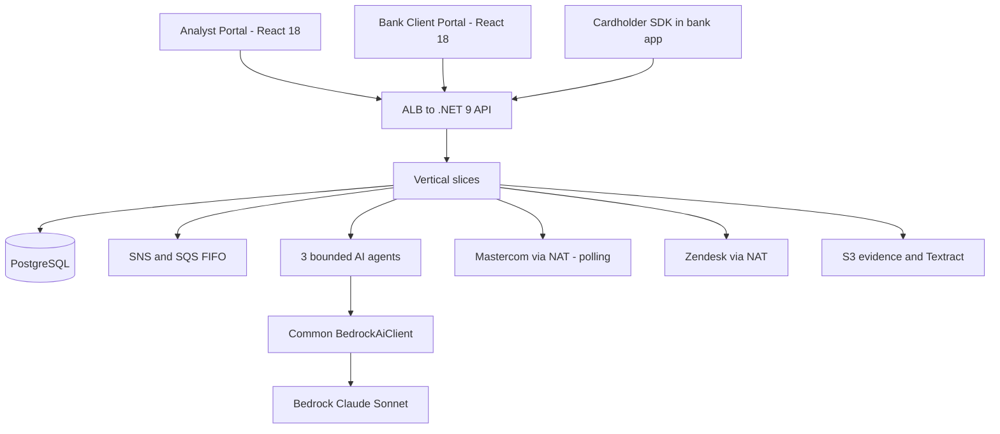
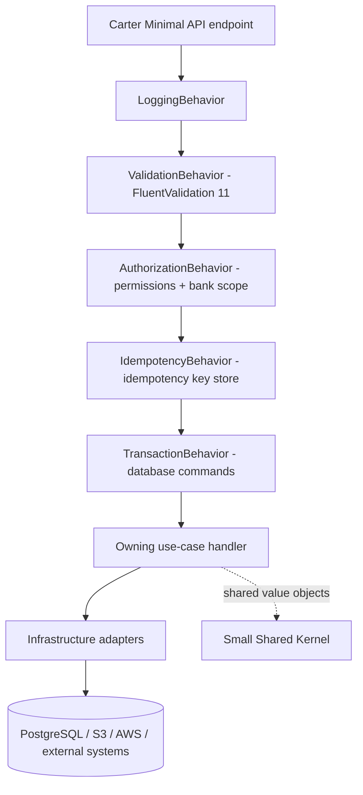
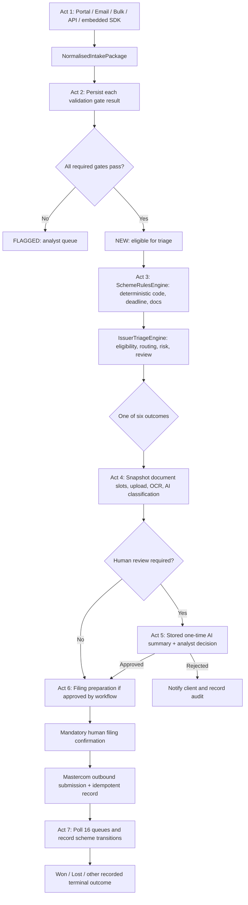

# Chargeback Management Platform — Unified Frontend, Backend & AI Development Guide

**Version:** 1.5 — reconciles v1.4 with the repository: corrected migration list, migration 0005 (approved role matrix), `RETRIAGE_CASE` for re-triage (supersedes ADR-0124's `UPDATE_CASE_STATUS`), §9 implementation-alignment backlog, refreshed decision list. Previous: v1.4 — adds approved permission/role matrix, case status vocabulary, transition model, ADR-0106 idempotency, approved API contracts from Q18–Q31 answers (approved pipeline order; bank-scope clarification). Previous baseline: v1.2 (diagram + end-to-end process baseline, approved ERD 10-gate list).  
**Source:** Six user-supplied diagrams (AI, .NET 9 backend, PostgreSQL ERD, React 18 frontend, AWS VPC, end-to-end process flow) plus session decisions (Sep 2026).  
**Scope:** A shared handoff for UI, API, AI and database engineers.  
**Important:** This is the *diagram-aligned MVP baseline*, not a declaration that every open scheme, Mastercom or bank-specific contract is resolved. An older expanded 110-feature package exists and uses a **different canonical schema and broader AI capability list**. Do not apply this diagram SQL to that package's database. This handoff uses the diagram SQL only for a fresh development database. Obtain explicit approval of this schema before writing migrations or schema-dependent features.

## 1. What the teams are building

A licensed Chargeback Management Platform deployed once in a processor-owned AWS account/VPC, serving several bank clients. Three frontend surfaces: processor Analyst Portal, bank Client Portal, and an SDK embedded in a bank app. A single .NET 9 backend implements business workflows. Three bounded logical AI agents provide extraction, classification and explanation, but cannot select final reason codes, file claims, change case state or move money. PostgreSQL holds transactional data and versioned authoritative rules; private S3 holds evidence files. Mastercom and Zendesk are outbound integrations.



**Cloud accuracy:** CloudFront is a regional/global managed CDN *outside* VPC subnets; private S3 origins can use origin access control. The backend and private data resources run inside VPC subnets. Production multi-AZ and DR must be designed and tested independently of the cost-optimized POC diagram.

## 2. Frontend architecture — React 18

| Surface | Main pages / functions | Access boundary |
|---|---|---|
| Analyst Portal | Intake queue, case list/detail/timeline, human review, evidence/document checklist, filing, client communications, Admin/Settings | Processor users with explicit permissions and permitted bank scope |
| Bank Client Portal | Intake form, CSV/Excel dry-run and upload, own cases, evidence upload, message thread, notifications | Bank user; only own bank data |
| Embedded SDK | Conversational guided intake, eligibility pre-check, structured intake submission | Runs in bank app, uses host-app/session integration, not Client Portal session |

**Frontend flow:** React Router → page → feature hooks → API service → HTTPS .NET API. React Query/TanStack Query handles server state; `authStore` holds authenticated `userType`, role, permission codes and bank scope; local UI store holds dialogs/toasts; Zod validates API responses; React Hook Form manages forms; date-fns formats dates. Do not calculate Mastercard deadlines on the client as an authority: display server-calculated values.

**UI changes required by latest diagrams:**
- Admin/Settings: processor/bank user management, roles and permissions, bank configuration; hide unauthorized actions using `PermissionGuard`, and *recheck on backend*.
- Evidence & Documents: `DocumentStageBadge` = `Initial`, `PreArbitration`, `Arbitration`; `DocumentStatusBadge` = `Pending`, `Processing`, `Success`, `Failed`.
- Case/review pages show a reason code **returned by deterministic backend rules** and AI explanations labelled advisory. Confirm before filing/status changes.
- Client Portal excludes internal analyst notes and any other bank's data. SDK cannot inherit portal session.
- Frontend tests: Jest + React Testing Library for components/hooks, permission visibility and document state; Cypress for key E2E analyst, client and SDK journeys; accessibility and responsive checks.

**Frontend dependency constraints (do not upgrade without approval):**
- MSW v2 (not v3)
- ESLint v9 (not v10)
- Do NOT call Bedrock/AWS SDK from the browser
- No cross-surface imports between Analyst Portal, Client Portal, and SDK
- No portal session code in SDK

## 3. Backend architecture — .NET 9 vertical slices

**Runtime:** One ECS Fargate application. A *slice* is a code organization boundary, not a separate container or microservice.

**Approved MediatR pipeline order (v1.4 — Idempotency added):**



Order: `Logging → Validation → Authorization → Idempotency → Transaction → Handler`. Idempotency sits after Authorization (principal is known) and before Transaction (replay returns without opening a new transaction).

**Endpoint groups:** Intake, Triage, Case, Filing, Review, Document, SchemeLifecycle, SDK, ClientPortal and Admin.

**Eight diagram feature slices:**
1. **Intake:** Portal/email/bulk/direct API/SDK normalization into `NormalisedIntakePackage`; 10 diagram gates; persist dispute and gate outcomes.
2. **Triage & Rules:** `SchemeRulesEngine` reads approved/versioned structured PostgreSQL rule data to derive reason code, deadline and document requirements; `IssuerTriageEngine` applies hard eligibility, routing, risk and human review trigger; outcomes: `ProceedToFiling`, `AutoRefund`, `RouteToHuman`, `SendToCompliance`, `Invalid`, `Defer`.
3. **Case Management:** Case creation/status, append-only event history, per-case API log and scheme lifecycle coordination.
4. **Human Review:** Analyst decision workspace, stored AI plain-language summary, deterministic reason-code selection screen, triage/activity trail.
5. **Evidence & Documents:** Slot checklist, stage on every uploaded document, processing indicator, S3, Textract OCR and advisory classification.
6. **Network Filing — Mastercom:** Build payload, explicit human confirmation, idempotency/reconciliation, poll 16 queues; no Mastercom inbound webhooks.
7. **Client Portal & Communications:** Curated event-derived bank case view, portal messages, Zendesk email-only bank communication and signed/replay-protected Zendesk webhook.
8. **Admin & Configuration:** Banks, users, roles, permissions, configurable thresholds and versioned scheme rules.

**MediatR in simple terms:** endpoint sends a command/query; MediatR finds the owning handler and runs common logging, request validation, permission/scope checks, idempotency check and database transaction behavior. The *10 chargeback gates* are separate business validations inside Intake—not FluentValidation rules. Do not keep a database transaction open across long-running Bedrock, S3 or Mastercom calls.

**Backend dependency constraints (do not upgrade without approval):**
- MediatR pinned to v12.x (Apache-2.0) — v13+ is commercially licensed; do not upgrade
- No AutoMapper (commercial license)
- FluentAssertions v7.x only — v8+ is commercially licensed; use v7.x or Shouldly

**Shared Kernel:** `BaseEntity`, `AuditableEntity`, `Result<T>`, `PagedResult<T>`, `ICurrentUser`, `DomainEvent`, and small common value objects `Money`, `CardMasked`, `CurrencyCode`, `ReasonCode`, `GateResult`, `TriageOutcome`, `DocumentStage`, `DocumentStatus`. Business engines remain in their owning slices; infrastructure implements adapters (`ChargebackDbContext`, `DapperQueryService`, `S3DocumentStore`, `BedrockAiClient`, `MastercardGateway`, `ZendeskClient`, `TextractClient`, Cognito validator, SNS/SQS and SES).

**RBAC and bank scope (updated v1.4):** `user_type` identifies PROCESSOR/BANK/ADMIN scope; `role_id` links role; `role_permissions` links explicit capabilities; `users.bank_id` scopes bank users.

**Critical bank scope rule:** `NULL bank_id` on the `users` row **never implies cross-bank access**. No processor role gets implicit access to all banks. Every processor user sees only the banks listed in their `user_bank_scopes` rows. Bank scope is resolved by server-side lookup; the JWT identifies the principal but is not the sole authority for bank access. A request to access another bank's resource returns `404` — existence is not revealed. A request to filter by an unauthorized bank returns `403`.

Processor users may view bank users only with `VIEW_BANK_USERS` **and** an authorized bank scope. A bank user can access only its own bank. Authorization must be server-side and tested against direct API calls; UI hiding alone is insufficient.

**Testing & Quality (outside runtime):** xUnit unit tests for handlers, FluentValidation, ten gates, deterministic rules/reason codes, deadlines, RBAC/bank scope, document stage/status; API/PostgreSQL/RLS integration tests; mocked Bedrock/Textract/Zendesk and Mastercom contract tests; end-to-end workflows. Gate CI on relevant tests and security scans.

## 3.1 Approved Permission Codes and Role Matrix (v1.4)

The following permission codes and role assignments are approved. BANK users hold none of these permissions; they access the Client Portal through `userType = BANK` scope alone.

| Permission Code | Analyst | Senior Analyst | Compliance Officer | Admin |
|---|:---:|:---:|:---:|:---:|
| `VIEW_CASES` | ✓ | ✓ | ✓ | ✓ |
| `UPDATE_CASE_STATUS` | ✓ | ✓ | ✓ | ✓ |
| `ASSIGN_CASE` | — | ✓ | — | ✓ |
| `VIEW_TRIAGE` | ✓ | ✓ | ✓ | ✓ |
| `RETRIAGE_CASE` | — | ✓ | — | ✓ |
| `VIEW_BANK_USERS` | ✓ | ✓ | ✓ | ✓ |

**Implementation notes:**
- Permission checks are enforced server-side by `AuthorizationBehavior`; UI `PermissionGuard` components are a secondary layer only.
- The full permission catalogue for non-case endpoints (intake, documents, filing, admin, SDK) is still an open decision (Q4). Do not assume the above list is exhaustive.
- Frontend: permission codes are declared in `packages/domain/src/auth.ts`; add `RETRIAGE_CASE` alongside the others.
- Migration 0003 adds `ASSIGN_CASE`; `VIEW_CASES` and `UPDATE_CASE_STATUS` were in the baseline schema.
- **v1.5:** `VIEW_TRIAGE` and `RETRIAGE_CASE` are now defined in the baseline (fresh installs) and in migration `0005_role_permission_matrix.sql` (existing databases). Migration 0005 also creates the four roles (`Analyst`, `Senior Analyst`, `Compliance Officer` as `PROCESSOR`; `Admin` as `ADMIN`) and seeds exactly the matrix above: 20 `role_permissions` rows. It grants **no bank scope**; `user_bank_scopes` rows are still required per user.
- **Re-triage** (`POST /cases/{caseId}/retriage`) requires `RETRIAGE_CASE`. This supersedes ADR-0124's use of `UPDATE_CASE_STATUS`. The other ADR-0124 rules still apply: manual only, FLAGGED or UNDER_REVIEW only, reason required.
- `CREATE_DISPUTE` (ADR-0111) is defined but is **not in the approved matrix**. Until a role holds it, intake is unusable outside tests (see §8 #21).
- Still proposed and not seeded: `REVIEW_CASE`, `VIEW_FILINGS`, `SEND_PORTAL_MESSAGE`, `MANAGE_BANKS`, `MANAGE_ROLES`, `MANAGE_BANK_SCOPES`, `VIEW_SCHEME_RULES`, `MANAGE_SCHEME_RULES`, `MANAGE_BANK_TRIAGE_CONFIG`.

## 3.2 Case Status Vocabulary and Transition Model (v1.4)

**Approved status values** (enforced by CHECK constraint in migration 0003):

`NEW` | `FLAGGED` | `UNDER_REVIEW` | `APPROVED` | `REJECTED` | `FILED` | `CLOSED`

**Transition endpoint (only permitted way to change case status):**

```
POST /cases/{caseId}/transitions
Idempotency-Key: <uuid>

{
  "action": "string",        // e.g. "START_REVIEW"
  "rationale": "string",     // optional; required for some transitions
  "expectedVersion": number  // optimistic concurrency
}
```

- There is **no PATCH endpoint** on the case status field.
- The server computes and returns `validActions` in every case response body so the UI can enable/disable buttons without hard-coding transition logic.
- Invalid transitions return `422` with `code: INVALID_TRANSITION`.

**Approved transition table:**

| From | To | Who / how |
|---|---|---|
| `NEW` | `UNDER_REVIEW` | Case status API — analyst manual |
| `FLAGGED` | `UNDER_REVIEW` | Case status API — analyst manual |
| `UNDER_REVIEW` | `APPROVED` | Human Review workflow (Phase 9) |
| `UNDER_REVIEW` | `REJECTED` | Human Review workflow (Phase 9) |
| `APPROVED` | `FILED` | Filing workflow (Phase 10) |
| `REJECTED` | `CLOSED` | Case status API — analyst manual |
| `FILED` | `CLOSED` | Case status API — admin only |

**Action vocabulary (approved 2026-10-01):**

| Action | Transition | Endpoint |
|---|---|---|
| `START_REVIEW` | NEW / FLAGGED → UNDER_REVIEW | `/transitions` |
| `CLOSE` | REJECTED → CLOSED (analyst); FILED → CLOSED (admin only; otherwise 403) | `/transitions`, rationale required |
| `FLAG` / `UNFLAG` | none approved yet (§8 #22) | `/transitions`, always 422 |
| `APPROVE` / `REJECT` | UNDER_REVIEW → APPROVED / REJECTED | `POST /cases/{id}/review/decision` |
| `FILE` | APPROVED → FILED | `POST /filings/{id}/confirmation` |

- `CLOSE` is one action; the server picks the permission from the current status.
- `APPROVE`, `REJECT` and `FILE` appear in `validActions` but return `422 INVALID_TRANSITION` on `/transitions`.
- `validActions` is computed per caller (status, user type, permissions). Bank users get none.
- **Concurrency:** `expectedVersion` in the body only; stale → `409 CASE_VERSION_MISMATCH`. No `If-Match`, 428 or 412 on `/transitions`. ETags on GET stay. `PATCH /cases/{id}/status` has been removed.
- **Implemented (v1.5):** the endpoint, the action model and `validActions` are live and published in `openapi-v1.json`.

**Case creation rule:** Every dispute gets a case. A dispute that fails one or more intake gates creates a `FLAGGED` case. A dispute that passes all gates creates a `NEW` case and is automatically submitted to triage.

## 3.3 ADR-0106 — Idempotency Key Store (v1.4)

**Approved design summary. Full ADR available from the backend team.**

**Database table:** `chargeback_diagram.idempotency_keys` (migration `0004_idempotency_keys.sql`)

```sql
-- Key columns (see migration for full DDL)
principal_id     uuid     -- FK to users; per-user scope
operation        varchar(100)
idempotency_key  varchar(128)
request_hash     char(64) -- SHA-256 of request body
state            varchar(16) CHECK (state IN ('IN_PROGRESS','COMPLETED'))
response_status  integer
response_body    jsonb
resource_id      uuid     -- created resource, where applicable
created_at       timestamptz
completed_at     timestamptz -- required when COMPLETED
expires_at       timestamptz -- created_at + 90 days
UNIQUE (principal_id, operation, idempotency_key)
```

**Pipeline position:** `IdempotencyBehavior` sits after `AuthorizationBehavior` and before `TransactionBehavior` (principal is known; replay short-circuits without opening a transaction).

**TTL and purge:**
- Keys expire after **90 days**; nightly in-process purge job uses `pg_try_advisory_lock`, batch size 5,000.
- `processed_domain_events` are also purged at 90 days in the same nightly job.
- Health endpoint reports `degraded` if the purge job fails 3 consecutive nights.

**Error codes:**

| Condition | HTTP | Code |
|---|---|---|
| Same key, **different** body | 422 | `IDEMPOTENCY_KEY_REUSED` |
| Same key, request still in flight | 409 | `IDEMPOTENCY_REQUEST_IN_PROGRESS` + `Retry-After: 5` |
| DLQ requeue, message > 90 days old | 422 | `DLQ_MESSAGE_EXPIRED` |

**Replay behaviour:**
- A `COMPLETED` record with the same key and matching body returns the stored response with `Idempotent-Replayed: true` header.
- **Failed** attempts (4xx / 5xx) are **not** stored; the client may retry the same key + body without conflict.

**CORS:** `Retry-After` **must** appear in `Access-Control-Expose-Headers`.

**Frontend (`useIdempotentMutation.ts`):**
- Generate a new UUID v4 key whenever the form body changes.
- Max **6 retries** on 409; cap `Retry-After` at 30 s.
- `Idempotent-Replayed: true` is treated as a fresh success.

**SDK:** Idempotency is the **host application's responsibility**. The SDK passes through whatever key the host app provides; it does not generate or manage keys itself.

**Implementation gate:** Stubs marked `KNOWN_LIMITATION_ADR0106_` may be inverted once migration 0004 has shipped and integration tests have passed **3 consecutive runs**.

## 3.4 Approved API Contracts (from Q18–Q31, v1.4)

These decisions are approved and binding for both backend and frontend teams.

**General conventions:**
- JSON field naming: **camelCase** throughout.
- Timestamps: **UTC ISO-8601** — `2026-09-29T10:00:00Z`. Deadline dates: `YYYY-MM-DD`.
- Error body: **RFC 7807 ProblemDetails** — `{ type, title, status, detail, code, errors?, traceId }`. The `code` field is a machine-readable string (e.g. `INVALID_TRANSITION`).

**Case references:**
- Format: `CB-YYYY-NNNNNN` (e.g. `CB-2026-000042`).
- Global sequence — no annual reset. Year component is the creation year in UTC. Gaps in the sequence are acceptable.

**Pagination (all list endpoints):**
- 1-based page numbering. Default page size: **20**. Maximum: **100**.
- Query params: `page`, `pageSize`, `sortBy`, `sortDirection`.
- Response includes `totalCount`.
- Invalid page/pageSize → `400`. Unsupported `sortBy` field → `400 INVALID_SORT_FIELD`.
- Default sort: `createdAt` descending.

**Resource visibility:**
- A resource in another bank's scope → **404** (existence not revealed).
- A filter that references an unauthorized bank → **403**.

**Gate results endpoint:**
- `GET /disputes/{disputeId}/gate-results` — keyed by `disputeId`, **not** `caseId`.
- Keyed by `disputeId` because `gate_results.dispute_id` is the FK in the baseline schema.

**Intake channels** (enum stored on dispute): `PORTAL` | `EMAIL` | `BULK` | `API` | `SDK`.

**Bulk upload — two-step flow:**
1. `POST /intake/bulk/dry-run` — validate CSV/Excel, return preview/errors.
2. `POST /intake/bulk` — commit; body includes `dryRunId` from step 1.

**Filing endpoints (Phase 10 stubs — paths are approved):**
- `POST /cases/{caseId}/filings` — initiate filing (stub until Phase 10).
- `POST /filings/{filingId}/confirmation` — Mastercom confirmation; requires explicit human action (stub until Phase 10).

**PAN / sensitive data (absolute rules):**
- PAN masked to **last 4 digits** everywhere: logs, AI prompts, case fields, response bodies. Full PAN never transmitted.
- AI agents **never** derive reason codes, never file, never change case state.
- Explicit human confirmation required before any Mastercom filing; no AI or background worker may bypass this.

## 4. AI architecture — exactly 3 logical agents / 6 diagram capabilities

| Agent | Capability | Called by | Output / authority |
|---|---|---|---|
| Extraction | Email Parser | Intake | Candidate structured facts in `NormalisedIntakePackage`; review low confidence |
| Extraction | SDK Intake Guide | Embedded SDK / Intake | Conversational question/answer into structured draft; backend eligibility remains deterministic |
| Classification | Attachment Matcher | Intake / Documents | Suggested mapping of attachments to document slots with confidence |
| Classification | Document Verification | Documents | Suggested type/correctness/uncertainty; human may override |
| Analysis & Explanation | Triage Summary | Triage / Human Review | Explain the **existing** deterministic result, code, deadline and next steps |
| Analysis & Explanation | Evidence Analysis | Documents / Human Review | Advisory strength/gaps and rationale; no filing authority |

All capabilities use `BedrockAiClient`: mask PAN to last four before model input; version prompt templates; temperature 0; structured JSON/schema validation; bounded timeout/retry/fail-soft; record model/version, prompt/version, latency, token counts, decision/override and bank/case scope in `ai_decision_logs`; feature flags per agent/bank/environment. Do not log full PAN/CVV or execute model-supplied instructions. AWS Textract provides OCR, S3 stores originals, PostgreSQL stores audit and business state.

**Knowledge Base / reason codes:** Semantic/vector and keyword retrieval may suggest *relevant documentation* but are not authoritative. Only approved, effective, versioned relational scheme rules determine the final reason code. pgvector or a separate KB is an **open design choice**; this baseline SQL deliberately does not invent a vector schema.

## 5. Diagram-based PostgreSQL database

The companion `CHARGEBACK_DIAGRAM_BASELINE.sql` creates a **fresh, standalone diagram-aligned development schema** (`chargeback_diagram`) including banks, users, roles/permissions, rule specs, disputes/gates/cases/triage, document slots and documents with stage/status, portal/Zendesk communications, filing/log, AI decision logs and domain-event outbox. It also adds `user_bank_scopes` because the diagram's `bank_id = NULL` alone is **not sufficient** to grant every processor user cross-bank access. Run it in a fresh development database using `psql -v ON_ERROR_STOP=1 -f CHARGEBACK_DIAGRAM_BASELINE.sql`.

**Do not run it on the expanded package database.** The earlier canonical package instead uses tables such as `reason_codes`, `rules`, `intake_records`, `determinations`, `gate_evaluations`, `evidence_items`, `mastercom_submissions`, and has its own versioned DDL and RLS design. Mixing these two schemas without a deliberate mapping/migration would create conflicting sources of truth.

**Approved migrations (v1.4):**

| Migration | Contents |
|---|---|
| `0001` (baseline) | `CHARGEBACK_DIAGRAM_BASELINE.sql`: full diagram schema including `user_bank_scopes`; permission definitions only (the original ten plus `CREATE_DISPUTE`, `ASSIGN_CASE`, `VIEW_TRIAGE`, `RETRIAGE_CASE`); no role assignments |
| `0002_add_create_dispute_permission.sql` | `CREATE_DISPUTE` permission definition (ADR-0111); not assigned to any role |
| `0003_case_management.sql` | `processed_domain_events` (UNIQUE on `event_id`); `ASSIGN_CASE` permission; `cases_status_check` (`NEW, FLAGGED, UNDER_REVIEW, APPROVED, REJECTED, FILED, CLOSED`); `case_reference_seq` (1–999,999, no cycle, no yearly reset; ADR-0125) |
| `0004_idempotency_keys.sql` | `idempotency_keys` table (see §3.3); index on `expires_at`; index on `processed_domain_events.processed_at` for the 90-day purge |
| `0005_role_permission_matrix.sql` (v1.5) | `VIEW_TRIAGE`, `RETRIAGE_CASE`; the four approved roles; the §3.1 matrix (20 rows); no bank scope |

**Complete install** = 0001 followed by every `db/migrations/NNNN_*.sql` in order. All scripts are idempotent and transactional; the application never runs DDL (ADR-0004). Integration tests build every ephemeral database the same way. Migration tooling (Flyway, DbUp or other) is still open (§8 #25).

**Diagram's 10 gates** (to confirm with scheme SME): 1 Required Fields; 2 Transaction Lookup; 3 Card/Account Check; 4 Amount/Currency Check; 5 Time Window Check; 6 Duplicate Check; 7 Merchant/Category Check; 8 Reason Code Derivation; 9 Document Requirement; 10 Compliance Check. Store each outcome separately, but treat this list as the diagram's *provisional* gate vocabulary until validated against the expanded package's staged checks.

## 6. Canonical end-to-end process — implementation workflow

**Source:** supplied *Chargeback Management Platform — End-to-End Process Flow* image. This section captures its seven acts, operational hand-offs, persistence requirements and unresolved inconsistencies. Treat stage names and diagram labels as design inputs, not as externally verified Mastercard rules. The workflow orchestrator is .NET; AI assists only at defined seams.



### Act 1 — Dispute arrives

- Cardholder initiates within the **bank's own app** using the embedded SDK. Conversational AI guides intake, and the diagram shows an eligibility pre-check. If ineligible, show the exact reason in the bank app; do not silently create a case. If eligible, create a dispute with `channel = SDK`.
- Bank intake channels shown: **portal form, monitored email, CSV/Excel bulk upload and direct REST API**. All converge on `NormalisedIntakePackage`. Email extraction uses the Extraction Agent; structured inputs need not invoke an LLM.
- Persist intake channel, masked case facts and correlation/audit identifiers. Define how SDK pre-check relates to the later server-side ten-gate evaluation; an SDK pre-check cannot replace server-side checks.

### Act 2 — Ten sequential validation gates

- Run server-side validations in the agreed order; persist **one `gate_results` record per executed gate** with pass/fail, reason and timestamp. Show the complete gate trail to authorized analysts.
- Diagram outcome: **all pass → dispute status NEW**; **failure → FLAGGED / route to analyst**. A FLAGGED case is not automatically a final triage outcome.
- The diagram's labels, transcribed in displayed order, are: **1 Completeness & Consistency; 2 Transaction Lookup (ARN); 3 Identifier Cross-check; 4 Duplicate Detection; 5 Time Window Check; 6 Precondition Check; 7 Amount Validation; 8 Reason Code Derivation (data lookup); 9 Code-specific Requirements; an additional box also labelled 9 Rogatory/Regulatory Orders (wording unclear in image); 10 Regulatory Position (UK)**.
- **Resolved gate-list conflict:** The approved development registry is the ten gates from the updated ER diagram (listed in §5). Ignore the duplicated Gate 9 and differing labels in the earlier process-flow picture. Do not invent scheme-specific thresholds, failure rules, or rule values; request business approval where absent.

### Act 3 — Two-layer deterministic triage

1. **Scheme Rules Engine:** reads versioned `scheme_rule_specs`; derives the reason code, filing deadline, regional window and required evidence. A semantic KB can help locate documentation but cannot decide the code.
2. **Issuer Triage Engine:** runs Hard Eligibility, Routing Policy, Risk Scoring and Human Review Triggers against approved bank configuration.
3. Store `triage_results` with inputs/rule version and one of **ProceedToFiling, AutoRefund, RouteToHuman, SendToCompliance, Invalid, Defer**. These are workflow recommendations/outcomes; any consequential actions follow policy and required human controls.

### Act 4 — Evidence collection

- Snapshot the required document checklist onto the case when created; do not silently rewrite an existing case checklist after a scheme-rule change.
- Client uploads to document slots. Store the **document's scheme stage** separately from **processing status**: Initial / PreArbitration / Arbitration versus Pending / Processing / Success / Failed.
- S3 stores binaries; Textract extracts text; Classification Agent verifies document type and matches email attachments to candidate slots. Classification confidence and `AiBadge` are **advisory**; a successful upload is not equivalent to successful verification.
- Record processing failures for retry and preserve the dispute/case even when Textract or Bedrock is unavailable.

### Act 5 — Human review when triggered

- Route flagged or policy-selected cases to the analyst workspace with intake facts, ten-gate trail, deterministic reason-code choice, document checklist, triage trail and activity timeline.
- The **Analysis & Explanation Agent generates a plain-English summary once when the case first enters review**; store its text, model/prompt version and audit record. Do **not** regenerate it on page refresh. A separately authorized explicit refresh/versioning operation would require its own specification.
- Analyst approves or rejects under backend permission + bank-scope checks. Record reviewer, time, decision and rationale; rejection follows the client-notification path.

### Act 6 — Mastercom filing

- Assign the case reference, start the deterministic filing clock from the approved trigger date, calculate filing deadline/days remaining, select the scheme function code **450 / 453 as applicable under approved rules**, construct the exact submission payload and fill the relevant message template.
- Show payload for analyst review and require **explicit human confirmation before filing**. Neither AI nor an automated background worker may bypass that control.
- Submit outbound through the Mastercom gateway; persist request/response and idempotency key in `mastercom_filings` / `filing_api_log`. On timeout, reconcile/query before retrying. Do not invent missing scheme endpoints.

### Act 7 — Scheme lifecycle and continuous communications

- **Poll 16 Mastercom queues; no inbound Mastercom webhooks.** Persist each exchange and lifecycle transition, with correlation IDs and audit history.
- Diagram stages include Pending → Processed → Second Presentment → Pre-Arbitration / Pre-Arb Rejected → Arbitration → Won / Lost. These are **illustrative branches**, not an unconditional straight-line sequence; voluntary refund/withdrawal, technical reject, accept loss, issuer/acquirer actions and escalation require state-specific rules.
- Client Portal displays **stage-level, bank-scoped progress from the case event log**, without internal analyst notes. Portal threads are two-way; email-only clients communicate through Zendesk with signed/replay-protected inbound events.
- The platform exchanges with Mastercard through Mastercom; it does not communicate directly with the acquirer outside approved scheme channels.

### Cross-cutting implementation and acceptance tests

| Area | Required behavior | Tests to implement |
|---|---|---|
| Intake | Four bank channels plus embedded SDK converge on normalized intake | Input equivalence, SDK eligibility rejection, deduplication |
| Gates | Each executed gate persisted; all-pass NEW, failures FLAGGED | Registry/order/applicability; every gate pass/fail; audit; ambiguity blocked pending sign-off |
| Rules/Triage | Versioned deterministic reason-code, deadline and six outcomes | Rule boundaries, bank config, time windows, never AI-derived code |
| Evidence | Immutable case checklist snapshot; independent stage and processing status | S3 failure, OCR failure/retry, AI uncertain classification, document stage transitions |
| Review | Stored once-on-entry AI summary; reviewer owns decision | No page-refresh regeneration, permission/scope checks, decision audit |
| Filing | Human confirmation, deterministic payload and idempotent outbound call | No auto-file, timeout/reconciliation, duplicate submission prevention |
| Lifecycle | Polling, event log, conditional transitions and bank-safe progress | Poll all configured queues, replay/idempotency, branch/state tests, no internal notes leaked |
| Resilience | Textract, Bedrock or Zendesk outage does not lose a dispute | Queue/backoff, recoverable status, safe client messages |
| Bank isolation | Processor user sees only banks in `user_bank_scopes`; other-bank resource → 404 | Scoped-analyst persona test suite (14+ tests); direct API calls without UI layer |
| Idempotency | Replay returns stored response; different body → 422; in-flight → 409 | All error codes, Retry-After header, purge job, CORS header |

**Implementation boundary:** The original diagram says 'AI recommends at Act 3' and 'final decisions are made by platform logic or analyst'. Read this consistently with the AI architecture: AI may explain or summarize deterministic triage, but **must not choose a reason code, independently approve/refund/file, or change a case state**. Where the diagram is unclear, record a decision rather than inventing behavior.

## 7. AWS VPC and delivery sequence

- `eu-west-1`; public ALB, private ECS app and AI processing, private PostgreSQL and evidence S3. Use VPC endpoints where supported; outbound NAT for approved Mastercom/Zendesk calls. CloudFront fronts private S3 website origins but does not sit inside the VPC.
- Phase 1 diagram: ECS single application, PostgreSQL Single-AZ, SNS/SQS FIFO, three logical AI agents, common Bedrock runtime; no Redis or WAF. **This is a cost-optimized POC, not a production HA claim.**
- Phase 2 roadmap: WAF, ECS scaling, RDS Multi-AZ/read replica, MSK if warranted, Redis, Step Functions polling, tracing, approved DR. Cost figures shown in diagrams are estimates requiring new AWS pricing validation.
- Deliver first: repository structure and contracts → auth/RBAC/RLS → intake + gate skeleton → rules/triage tests → document upload/stage/status → AI mocked capabilities/evaluations → React pages → simulated filing/polling → external conformance → production readiness review.

## 8. Required decisions — status as of v1.5

| # | Decision | Status |
|---|---|---|
| 1 | Confirm whether diagram MVP or expanded 110-feature package is implementation source of truth | **Open** — never mix schema tables |
| 2 | Ten gate names/order approved from ER diagram. Gate-specific thresholds, applicability and failure policies need business approval before implementing | **Partially resolved** — registry order approved; thresholds open |
| 3 | Exact Mastercom API endpoint mappings, scheme values, polling and sandbox credentials | **Open** |
| 4 | Full permission code catalogue for **non-case** endpoints (intake, documents, filing, admin, SDK) | **Open** — case/triage/bank-user permissions approved in §3.1 |
| 5 | Confirm whether document `scheme_stage` is assigned at upload or inferred from server case state; keep immutable upload-stage audit | **Open** |
| 6 | FAQ vector/keyword KB store and approved source/version/tenant filtering; must not be used for authoritative reason-code derivation | **Open** |
| 7 | Confirm production RLS/grants, DR data residency, failover AI behavior and environment-specific security configuration | **Open** |
| 8 | ADR-0119 — Bank configuration and thresholds table design | **Open — awaiting business approval** |
| 9 | ADR-0120 — Rule condition format in `scheme_rule_specs.conditions_json` | **Open — awaiting business approval** |
| 10 | ADR-0121 — Missing dispute facts (claim type, MCC) | **Open — awaiting business approval** |
| 11 | ADR-0122 — Date basis and filing-clock settings | **Open — awaiting business approval** |
| 12 | Assignment and re-triage scope | **Resolved** — ADR-0124 accepted (manual, analyst-only); permissions `ASSIGN_CASE` / `RETRIAGE_CASE` per §3.1 |
| 13 | Bank-user visibility of gate results (Q23) | **Open** |
| 14 | Card capture in client intake form (Q26) | **Open** |
| 15 | SDK distribution format and integration (Q5) | **Open** |
| 16 | Bank branding for Client Portal (Q6) | **Open** |
| 17 | Live updates mechanism — polling / SSE / WebSocket (Q8) | **Open** |
| 18 | Bulk upload template and limits (Q9) | **Open** |
| 19 | Admin MVP scope (Q11) | **Open** |
| 20 | Hosting / domains per surface (Q12) | **Open** |
| 21 | Which roles hold `CREATE_DISPUTE`, and how bank users submit intake via Client Portal/SDK | **Open** — intake unusable outside tests until assigned |
| 22 | Remaining ADR-0110 transition questions: direct close of NEW/FLAGGED/UNDER_REVIEW; UNDER_REVIEW → FLAGGED/NEW; status effect of `Invalid` / `AutoRefund` triage outcomes | **Open** |
| 23 | Other status vocabularies: `disputes.status` beyond NEW/FLAGGED, `cases.priority`, `mastercom_filings.*`, `banks.status`, `zendesk_tickets.status` | **Open** |
| 24 | Gate result history / `gate_definition_version` column (ADR-0117); gate re-evaluation | **Open** — gate behaviour approved; schema proposed |
| 25 | Migration tooling and applied-migration tracking | **Open** |
| 26 | Bulk dry-run storage and retention for `dryRunId` (ties to ADR-0112 and #18) | **Open** |
| 27 | Whether auditors require gap-free case references (ADR-0125) | **Open** — gaps accepted per §3.4 unless auditors object |

**Resolved in v1.5:**
- Role matrix seeded by migration 0005; `VIEW_TRIAGE` and `RETRIAGE_CASE` defined → §3.1, §5
- Re-triage permission is `RETRIAGE_CASE` → §3.1
- `FILED → CLOSED` is admin-only manual → §3.2
- Migration list corrected to match `db/migrations/` → §5

**Approved / resolved in v1.4:**
- Permission codes and role matrix → §3.1
- Case status vocabulary and transition model → §3.2
- Idempotency key store (ADR-0106) → §3.3
- API contracts (camelCase, case reference format, pagination, error body, timestamps, gate results endpoint, intake channels, bulk upload flow) → §3.4
- Bank scope rule (NULL bank_id ≠ all-bank access) → §3
- Pipeline order with Idempotency → §3 / §3.3
- Case creation trigger (every dispute gets a case) → §3.2

## 9. Implementation alignment backlog (v1.5)

The repository (Phases 5–7) was built before some v1.4 contracts were approved. The approved contract wins. Each row is a backend change to schedule; the frontend should code against the **approved** column and use MSW mocks until the change ships.

| Area | Approved (this guide) | Current implementation | Change needed |
|---|---|---|---|
| Case status change | `POST /cases/{id}/transitions` `{action, rationale, expectedVersion}` + `Idempotency-Key`; `validActions` in case responses; `422 INVALID_TRANSITION`; no PATCH | **Done (2026-10-01)** | None |
| `FILED → CLOSED` | Admin only, manual | **Done (2026-10-01)**; ADR-0110 updated | None |
| Re-triage permission | `RETRIAGE_CASE` | **Done (2026-10-01)**; ADR-0124 updated | None |
| Permission constants | `VIEW_TRIAGE`, `RETRIAGE_CASE` seeded | **Done (2026-10-01)**: both in `Permissions.Seeded` | Add a `Migration_0005` idempotency test |
| Gate results path | `GET /disputes/{disputeId}/gate-results` | **Done (2026-10-01)**: renamed; `/gates` removed (no alias) | None |
| Pagination | Default `pageSize` **20**; `sortBy`/`sortDirection`; `400 INVALID_SORT_FIELD`; default sort `createdAt desc` | **Done (2026-10-03)** on all five list endpoints; supported fields published per endpoint in OpenAPI | Open: out-of-range `page`/`pageSize` are clamped, but §3.4 says 400. Confirm which |
| Error body | ProblemDetails with `traceId` | **Done**: `traceId` replaces `correlationId`; value is the W3C trace id (`Activity.Current.Id`), falling back to the request identifier. `X-Correlation-Id` is unchanged | None |
| Bulk upload | `POST /intake/bulk/dry-run`, then `POST /intake/bulk` with `dryRunId` | `POST /intake/bulk` only | Add the dry-run step (storage open: §8 #26) |
| CORS | `Retry-After` in `Access-Control-Expose-Headers` | **Done (2026-10-03)**: exposes `Retry-After`, `Idempotent-Replayed`, `ETag`; allows `Authorization`, `Content-Type`, `Idempotency-Key`, `If-Match`, `X-Correlation-Id` | Origins come from `Cors:AllowedOrigins`, which is empty until hosting domains are approved (§8 #20); set them per environment |

**Definition of done:** no feature ships without validated contracts, unit/integration tests, bank isolation tests, auditable business changes, fail-soft external dependencies and explicit owner sign-off on its open decisions.
